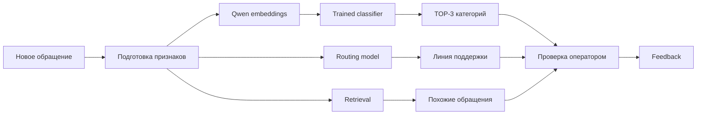

<p align="right">
  <b>Русский</b> · <a href="README.en.md">English</a>
</p>

# PostTech Radar

<p align="center">
  <b>ML/NLP-сервис для классификации и маршрутизации обращений Service Desk</b><br />
  Категория TOP-3 · рекомендация линии поддержки · похожие обращения · operator feedback
</p>

<p align="center">
  
  
  
  
  
  \n  <a href="https://github.com/Leo0742/PostTech-Radar/actions/workflows/ci.yml"></a>
</p>

## О проекте

Я делал PostTech Radar как учебный ML/NLP-проект для обработки обращений Service Desk. В исходной выборке было **1 931 размеченное обращение и 43 категории**.

Задача модели — по новому обращению показать оператору TOP-3 наиболее вероятных категорий. Кроме этого, сервис рекомендует линию поддержки и ищет похожие обращения в истории.

> **Что здесь именно моё:** я готовил данные, строил leakage-safe split, сравнивал baseline-модели, получал embeddings, обучал классификаторы поверх них, проверял 4B/8B варианты и собирал итоговые deployment pipelines. Qwen3-Embedding-4B/8B в финальных моделях используются как frozen encoders — я не выдаю это за full fine-tuning Qwen.

Чтобы это не приходилось искать по репозиторию:

- [как обучались модели — TRAINING.md](TRAINING.md);
- [подробная карточка моделей — MODEL_CARD.md](MODEL_CARD.md);
- [4B Lite deployment builder](scripts/v5_2_build_qwen4b_lite_deployment.py);
- [8B Quality deployment builder](scripts/v5_2_build_deployment.py);
- [grouped evaluation protocol](scripts/v5_protocol.py);
- [data/leakage audit](scripts/v5_data_audit.py);
- [LoRA/PEFT sanity experiment](scripts/v5_2_peft_sanity.py);
- [training reports](docs/training/).

Это не официальный продукт ПочтаТех. Репозиторий опубликован как мой студенческий portfolio project.

## Что я сделал

- подготовил импорт и проверку исходных данных;
- сделал классификацию обращения с **TOP-3** вариантами;
- сравнил **TF-IDF + Logistic Regression**, **LinearSVC**, **CatBoost** и embedding-based подходы;
- собрал два варианта pipeline на **Qwen3-Embedding-4B** и **Qwen3-Embedding-8B**;
- добавил structured metadata, prototype/kNN blend и TF-IDF specialist для сложных пар классов;
- сделал group-disjoint validation, чтобы дубли и почти одинаковые обращения не попадали одновременно в train и validation;
- отдельно проверял leakage и убрал target-like поле из specialist до финального измерения;
- пробовал PEFT/LoRA для 8B, но не оставил его в финальной модели, потому что стабильного улучшения не получил;
- сделал backend на FastAPI и frontend на React/TypeScript;
- добавил operator feedback и controlled retraining.

## Два варианта модели

В обоих вариантах Qwen используется как **frozen embedding encoder**, а классификационная часть обучается на моих размеченных данных.

| Профиль | Encoder | Основная идея |
|---|---|---|
| **Lite / 4B** | Qwen3-Embedding-4B | более лёгкий pipeline, 2560-d embeddings |
| **Quality / 8B** | Qwen3-Embedding-8B | более тяжёлый pipeline, 3072-d embeddings |

Финальный blend: supervised classifier + prototype + kNN. Для сложных confusion pairs используется отдельный leakage-safe TF-IDF specialist.

### Development metrics

| Pipeline | View | Top-1 | Top-3 | Macro-F1 |
|---|---|---:|---:|---:|
| **4B Lite** | TOP-15 | **80.781%** | **97.653%** | **76.008%** |
| **4B Lite** | FULL-43 | **73.276%** | **89.875%** | **55.292%** |
| **8B Quality (V5.2)** | TOP-15 | 79.883% | 97.136% | 74.007% |
| **8B Quality (V5.2)** | FULL-43 | 68.171% | 88.799% | 53.771% |

У 4B и 8B были свои tuning steps, поэтому эту таблицу нельзя трактовать как чистый benchmark размера encoder. Для отдельного matched comparison есть [этот отчёт](docs/training/MATCHED_QWEN4B_VS_QWEN8B.md).

У более раннего frozen 8B champion на отдельном V5 INTERNAL LOCKBOX TOP-15 было **81.19% Top-1 / 98.02% Top-3 / 76.40% Macro-F1**. Этот lockbox не использовался для последующего подбора V5.2.

## Как я проверял качество

Основная проблема датасета — повторяющиеся и очень похожие обращения. Поэтому обычный случайный split мог бы завысить результат.

Я сделал отдельный grouped protocol:

- **1 931** real labeled rows;
- **1 830** unique duplicate groups;
- **3 repeats × 4 folds = 12** frozen grouped folds;
- development: **1 241** rows;
- calibration: **306** rows;
- V5 INTERNAL LOCKBOX: **384** rows;
- group overlap audit: **PASS**;
- synthetic rows в validation: **0**.

Подробности: [V5_EVALUATION_PROTOCOL.md](docs/training/V5_EVALUATION_PROTOCOL.md).

## Что было с PEFT / LoRA

Я отдельно проверял LoRA для Qwen3-Embedding-8B. Sanity run прошёл: около **15.34M trainable parameters (0.2022%)**, loss на 20 шагах снизился примерно **1.603 → 1.312**, embeddings действительно менялись.

После этого более серьёзные PEFT-проверки не показали стабильного выигрыша относительно frozen encoder. Поэтому PEFT я **не стал оставлять в deployment только ради того, чтобы сказать, что модель fine-tuned**.

Код sanity-эксперимента: [scripts/v5_2_peft_sanity.py](scripts/v5_2_peft_sanity.py).

## Как работает сервис



## Стек

| Часть | Технологии |
|---|---|
| ML / NLP | Python, NumPy, Pandas, scikit-learn, CatBoost, PyTorch, Transformers, sentence-transformers, SciPy |
| Backend | FastAPI, Pydantic, Uvicorn, SQLite |
| Frontend | React, TypeScript, Vite |
| Testing | pytest, Vitest, Ruff |
| GPU experiments | CUDA, Qwen3 Embeddings, PEFT/LoRA |

## Что смотреть в репозитории

```text
scripts/
├── v5_data_audit.py                     # проверка полей и leakage
├── v5_dataset.py                        # загрузка real labeled dataset
├── v5_protocol.py                       # grouped CV + lockbox protocol
├── v5_experiment.py                     # experiment definitions + metrics
├── v5_gpu_runner.py                     # embedding helpers/cache
├── v5_2_build_qwen4b_lite_deployment.py # обучение и сборка 4B Lite
├── v5_2_build_deployment.py             # обучение и сборка 8B Quality
├── v5_2_peft_sanity.py                  # реальный LoRA sanity experiment
└── v5_2_benchmark_category_artifact.py  # latency/VRAM benchmark

configs/v5/                              # публичные 4B/8B configs
docs/training/                           # итоговые отчёты и сравнения
backend/app/ml/                          # inference/runtime
backend/tests/                           # split/runtime/data tests
```

## Данные и приватность

В public repo я **не выкладываю**:

- исходный XLSX с Service Desk обращениями;
- локальную SQLite-базу;
- сериализованные `.joblib` bundles;
- файлы с ticket-level примерами;
- server-specific operational artifacts.

Причина не в том, что модели отсутствуют. В исходном проекте были сохранены реальные deployment artifacts:

- 4B Lite: `models/v5/category_qwen4b_lite.joblib`, SHA-256 `ebd02b8d711b91a7b2ce63c30642d63a5e0a5a8320c2064f4be130c901550d26`;
- 8B Quality: `models/v5/category.joblib`, SHA-256 `5c02b1337590c4e59bc2c0bfd5f279a3baee6a0bfe6945de568265afdf010e98`.

Я не публикую binaries, потому что они построены на предоставленных Service Desk данных и могут содержать vocabulary или другие производные от непубличного текста. Вместо binaries здесь лежат **training code, configs, hashes и aggregate evaluation reports**.

Подробнее: [PUBLIC_REPOSITORY_NOTICE.md](PUBLIC_REPOSITORY_NOTICE.md).

## Проверка public repo

Public-версию можно проверить без исходного датасета и без GPU:

```bash
git clone https://github.com/Leo0742/PostTech-Radar.git
cd PostTech-Radar

python3 -m venv .venv
source .venv/bin/activate
python -m pip install --upgrade pip
python -m pip install -r requirements.txt

python -m compileall -q scripts backend/app backend/tests
python -m pytest backend/tests -q
```

Это те же основные проверки, которые запускаются в GitHub Actions. Тесты, которым нужен исходный Service Desk XLSX, в public repo корректно пропускаются.

### Воспроизведение 4B / 8B training

Для повторного обучения нужен **свой локальный экземпляр датасета** с тем же контрактом. Исходный Service Desk XLSX я не публикую.

Ожидаемый путь:

```text
data/raw/Обращения_1931.xlsx
```

Сначала нужно пересобрать data contract и frozen grouped protocol:

```bash
python scripts/v5_data_audit.py
python scripts/v5_protocol.py
```

GPU training рассчитан на NVIDIA CUDA. В моём окружении использовался PyTorch 2.8 + CUDA 12.8:

```bash
python -m pip install torch==2.8.0 torchvision==0.23.0 \
  --index-url https://download.pytorch.org/whl/cu128

python -m pip install -r requirements-v5-gpu.txt
```

После этого deployment bundles собираются отдельными командами:

```bash
# Qwen3-Embedding-4B Lite
python scripts/v5_2_build_qwen4b_lite_deployment.py

# Qwen3-Embedding-8B Quality
python scripts/v5_2_build_deployment.py
```

Скрипты скачивают pinned Qwen encoders, считают embeddings и обучают классификационную часть. Результаты сохраняются локально в `models/v5/`.

### Полный web-сервис

Полная версия, с которой я работал, использовала локальную SQLite-базу, обученные model bundles и исходные Service Desk данные. Эти файлы не входят в public repo, поэтому public snapshot не заявлен как полноценный web-demo, который запускается одной командой.

Public repository в первую очередь нужен, чтобы можно было проверить ML/training code, validation protocol, runtime, тесты и результаты без публикации непубличных обращений.

## Что я изучил на этом проекте

До этого у меня было больше опыта в Python/backend. На PostTech Radar я впервые глубже прошёл весь ML-процесс: data audit, baselines, grouped cross-validation, leakage, embeddings, model selection, PEFT experiments, deployment artifacts и анализ ошибок классификации.
