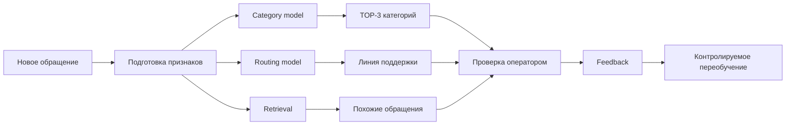

<p align="right">
  <b>Русский</b> · <a href="README.en.md">English</a>
</p>

# PostTech Radar

<p align="center">
  <b>ML/NLP-сервис для классификации и маршрутизации обращений Service Desk</b><br />
  Категория TOP-3 · рекомендация линии поддержки · похожие обращения · operator feedback
</p>

<p align="center">
  
  
  
  
  
  
</p>

## О проекте

> **Главное:** в этом проекте я сам готовил данные, обучал классификаторы и сравнивал модели. Финальный пайплайн использует **Qwen3-Embedding-8B как frozen encoder + обученный calibrated LinearSVC + prototype/kNN + TF-IDF specialist**. Он обучен на **1 931 реальном размеченном обращении**. Это не просто подключение готовой LLM по API.

[Подробнее о модели и обучении](MODEL_CARD.md)

Я делал PostTech Radar как учебный ML/NLP-проект для обработки обращений Service Desk. В исходной выборке было **1 931 размеченное обращение**.

Основная задача — по данным нового обращения помочь оператору быстрее понять, куда его направить. Сервис показывает несколько наиболее вероятных категорий, рекомендует линию поддержки и ищет похожие обращения в истории. Финальное решение остаётся за оператором, а его исправления можно сохранить как feedback для следующего контролируемого переобучения.

Это не официальный продукт ПочтаТех. Репозиторий опубликован как мой студенческий portfolio project.

## Что я сделал

- подготовил pipeline импорта и валидации данных;
- сделал классификацию категории обращения с **TOP-3** вариантами;
- добавил отдельную модель для рекомендации линии поддержки;
- реализовал поиск похожих обращений;
- сравнил **TF-IDF + Logistic Regression**, **LinearSVC**, **CatBoost** и embedding-подходы;
- использовал **Qwen3 Embeddings** как frozen encoder и обучал свои классификаторы поверх embeddings;
- сделал group-disjoint validation, чтобы одинаковые или почти одинаковые обращения не попадали одновременно в train и validation;
- добавил проверки на leakage;
- собрал backend на FastAPI и интерфейс на React/TypeScript;
- добавил operator feedback и ручной controlled retraining вместо автоматического переобучения после каждого исправления.

## Результаты экспериментов

Финальный lite-рецепт на leakage-safe cross-validation:

| Набор классов | Top-1 | Top-3 | Macro-F1 |
|---|---:|---:|---:|
| TOP-15 | **80.8%** | **97.7%** | **76.0%** |
| FULL-43 | **73.3%** | **89.9%** | **55.3%** |

Для меня в этом проекте важнее было не только получить метрику, но и правильно построить эксперимент: разделить данные без утечки, сравнивать модели на одинаковом протоколе и отдельно хранить production feedback.

## Как работает сервис



## ML-часть

В проекте я пробовал два основных направления.

**Классические модели:** TF-IDF по словам и символам, Logistic Regression, LinearSVC, CatBoost. Они дали хороший baseline и помогли понять, где сложность идёт от самих данных, а где от модели.

**Финальный embedding-пайплайн:** Qwen3-Embedding-8B как frozen encoder, обученный calibrated LinearSVC, blend с prototype/kNN и отдельный leakage-safe TF-IDF specialist для сложных пар классов. Также сравнивал Qwen3-Embedding-4B и другие варианты.

Для оценки использовал group-aware split и отдельные проверки на дубли/утечки. Holdout не использовался для подбора модели.

## Стек

| Часть | Технологии |
|---|---|
| ML / NLP | Python, NumPy, Pandas, scikit-learn, CatBoost, PyTorch, Transformers, sentence-transformers, SciPy |
| Backend | FastAPI, Pydantic, Uvicorn, SQLite |
| Frontend | React, TypeScript, Vite |
| Testing | pytest, Vitest, Ruff |
| Tools | Git, GitHub, Linux/macOS, CUDA |

## Структура

```text
backend/app/        FastAPI, сервисы и ML runtime
backend/tests/      тесты API, данных, split и ML-contracts
frontend/src/       React/TypeScript интерфейс
scripts/            подготовка данных, эксперименты и retraining
requirements*.txt   Python dependencies
```

## Данные и приватность

Исходный датасет, локальная SQLite-база и бинарные обученные model bundles **не публикуются**. В открытом репозитории оставлены ключевые части кода приложения, ML pipeline, тесты и dependency-файлы.

Причина простая: проект делался на предоставленных данных Service Desk. В сериализованных model bundles могут находиться словари и другие производные от обучающих данных, поэтому я не выкладываю сами веса/бандлы публично. Вместо этого в репозитории есть код обучения, runtime и отдельный MODEL_CARD с архитектурой, метриками и информацией о trained artifacts.

Подробнее: [PUBLIC_REPOSITORY_NOTICE.md](PUBLIC_REPOSITORY_NOTICE.md).

## Локальный запуск

Без исходного датасета и model bundles репозиторий в первую очередь служит как portfolio/source snapshot. Для своего набора данных можно подготовить окружение так:

```bash
python3 -m venv .venv
source .venv/bin/activate
pip install -r requirements.txt
```

Frontend:

```bash
cd frontend
npm install
npm run dev
```

Для GPU-экспериментов зависимости вынесены в `requirements-v5-gpu.txt`.

## Что я изучил на этом проекте

До этого у меня было больше опыта в обычной Python/backend-разработке. Здесь я глубже прошёл полный ML-процесс: подготовку данных, baseline, выбор метрик, cross-validation, leakage, embeddings, сравнение моделей и работу с ошибками классификации.

Проект продолжаю использовать как практику по классическому ML и NLP.
